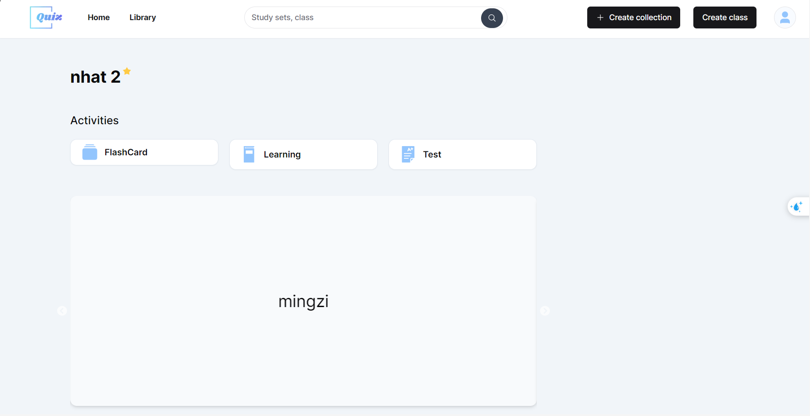

# ITSS-FlashCardWeb
This is a project to develop a website that creates flashcards for users

Nowadays, the need to learn foreign languages ​​is increasing. Learning vocabulary and grammar through flashcards appears as a method to support foreign language learning effectively and systematically, helping foreign language learners learn more easily. memorizing knowledge. The flashcard foreign language learning support system helps users create vocabulary flashcards according to their learning needs, and can build communities or classrooms to share vocabulary flashcards and foreign language materials.
# UI
* Home Page

* Collection Page

* Library Page

